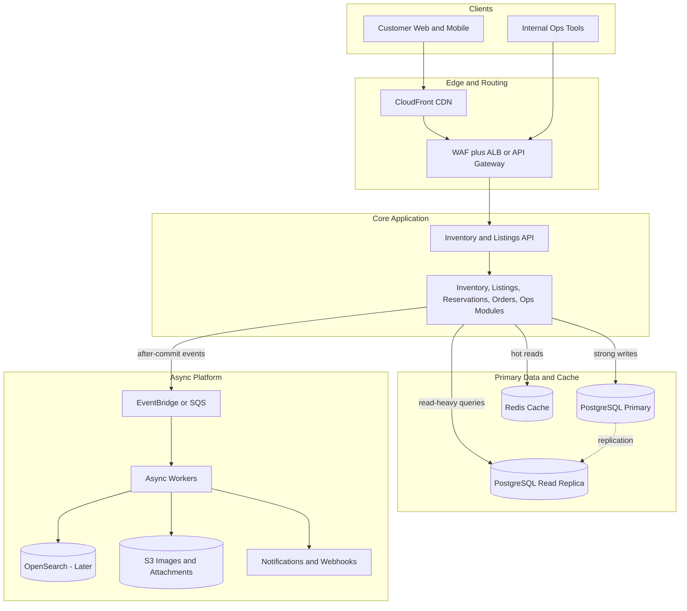
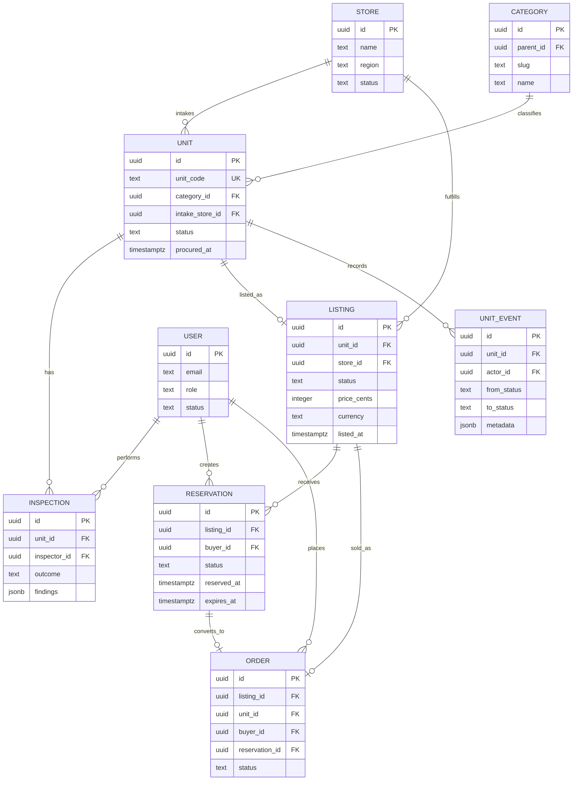
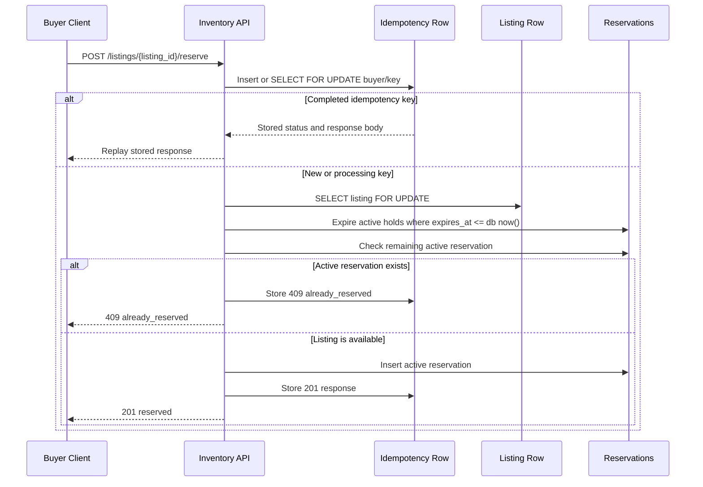

# ReGear Inventory and Listings System Design

## 1. Context and Assumptions

ReGear sells unique pre-owned units: one physical item equals one inventory record. The system must support internal store operations and a fast customer marketplace while preventing double booking during the 30-minute checkout reservation window.

Planning assumptions:

| Area | Assumption |
| --- | --- |
| Scale target | 30,000 units/month today to 200,000 units/month in 18 months, about 6,700 units/day. |
| Stores | About 150 intake centers, with store-level operational dashboards. |
| Write shape | Each unit creates several writes: intake, inspection, refurbishment, pricing, listing, reservation/order events. Average write QPS is modest, but store and checkout bursts matter. |
| Read shape | Marketplace browse/search/detail reads are expected to be 10x-100x write volume. Design target before a search split: hundreds to low thousands of read QPS. |
| Consistency | Reservation and order conversion require strong consistency. Search, listing cards, analytics, and notifications can be eventually consistent. |
| Source of truth | PostgreSQL is the source of truth for units, listings, reservations, orders, idempotency, and audit history. |

## 2. High-Level Architecture

Start with one modular Inventory and Listings API deployed as a single service. Keep strong consistency in PostgreSQL, use caches and read replicas for marketplace reads, and move non-critical side effects to asynchronous workers.

### Architecture Block Diagram

| Component | Responsibility | Notes |
| --- | --- | --- |
| Inventory and Listings API | Inventory lifecycle, listing APIs, reservation writes, ops dashboards. | Internally split modules: inventory, inspections, listings, reservations, orders, stores, users. |
| PostgreSQL primary | Strongly consistent writes and constraints. | Reservation transaction, idempotency, lifecycle audit, order conversion all use primary. |
| PostgreSQL read replica | Read-heavy list/detail/dashboard queries that tolerate replica lag. | Never used for reservation writes or final checkout availability. |
| Redis | Short-TTL listing/detail/search cache and hot operational summaries. | Cache is never the reservation source of truth. |
| EventBridge/SQS | Durable async fanout. | Used for search indexing, image jobs, alerts, emails, analytics, and audit enrichment. |
| Async workers | Retryable background processing. | DLQs for failed jobs; no customer-facing write waits on these. |
| OpenSearch | Future dedicated search/faceting engine. | Introduce after PostgreSQL indexed search and caching are no longer enough. |
| S3 | Images, inspection attachments, generated exports. | Object metadata remains in PostgreSQL. |

The API remains a single deployable initially because the data is tightly coupled and reservation correctness benefits from one transaction boundary. The code should still be modular enough to split catalog/search or pricing later.

## 3. Core Data Model

### ER Diagram

Supporting table: `idempotency_keys(buyer_id, idempotency_key, request_hash, status, response_status, response_body, created_at, updated_at)` stores canonical reservation outcomes for safe retries.

### Mutability and Integrity

| Entity | Immutable or Controlled Fields | Mutable Fields | Reasoning |
| --- | --- | --- | --- |
| Store | `id`, original store identity. | `name`, `region`, `status`. | Store metadata changes, but historical unit provenance must remain stable. |
| User | `id`. | `email`, `role`, `status`. | Roles change; audit references need stable actor ids. |
| Unit | `id`, `unit_code`, `intake_store_id`, `procured_at`. | `status`, category corrections, timestamps. | A unit is a traceable physical item. Lifecycle changes are controlled and audited. |
| Inspection | `id`, `unit_id`, `inspector_id`, `created_at`. | Findings only through correction/versioning. | Inspection history should be defensible; corrections should be auditable. |
| Listing | `id`, `unit_id`. | `status`, `price_cents`, `listed_at`, `updated_at`. | Commercial data can change before reservation/order; sold listings are locked. |
| Reservation | `id`, `listing_id`, `buyer_id`, `reserved_at`, `expires_at`. | `status`. | A hold's time window is fixed; it can become expired, released, or converted. |
| Order | `id`, `listing_id`, `unit_id`, `buyer_id`, `reservation_id`. | Payment/fulfillment status. | Purchase identity is immutable; fulfillment state evolves. |
| UnitEvent | All business fields. | None. | Audit log is append-only. |

Key constraints:

- `units.unit_code` is unique.
- A unit can have at most one active marketplace listing.
- A listing can have at most one active reservation via partial unique index on `reservations(listing_id) WHERE status = 'active'`.
- Reservation code expires stale active holds inside the transaction before inserting a new active hold.
- Idempotency is unique on `(buyer_id, idempotency_key)` and rejects key reuse with a different request hash.

## 4. API Surface

| Method | Path | Purpose | Auth and Concurrency Notes |
| --- | --- | --- | --- |
| `GET` | `/listings` | Marketplace search/list with category, price, status, pagination. | Public/customer; cacheable; read replica allowed. |
| `GET` | `/listings/{listing_id}` | Listing detail and current availability. | Short TTL cache; can read replica for display, primary for checkout validation. |
| `POST` | `/listings/{listing_id}/reserve` | Hold listing for 30 minutes. | Buyer auth; idempotency key required; primary DB transaction; locks listing row. |
| `DELETE` | `/reservations/{reservation_id}` | Release active reservation. | Buyer auth; only owner can release; idempotent release. |
| `POST` | `/orders` | Convert active reservation to order. | Buyer auth; locks reservation and listing; payment integration outside this scope. |
| `POST` | `/ops/units` | Intake procured unit. | Staff auth; creates unit and audit event. |
| `PATCH` | `/ops/units/{unit_id}/status` | Move unit through lifecycle. | Staff auth; validates allowed transition; appends `unit_events`. |
| `POST` | `/ops/units/{unit_id}/inspections` | Record inspection result. | Inspector/staff auth; updates unit status when appropriate. |
| `POST` | `/ops/listings` | Create listing from priced/refurbished unit. | Staff auth; ensures unit is listable and has no active listing. |
| `GET` | `/ops/dashboard/stuck-units` | Units stuck by store/status/time window. | Staff auth; indexed by status, updated time, and store. |

Reservation endpoint transaction:

1. Insert or lock `(buyer_id, idempotency_key)` and verify `request_hash`.
2. If completed, return stored response as replay.
3. Lock listing with `SELECT ... FOR UPDATE`.
4. Return replayable errors for missing or non-reservable listing.
5. Mark active expired reservations for the listing as `expired`.
6. If a non-expired active reservation remains, store and return `409 already_reserved`.
7. Insert active reservation with `expires_at = now() + interval '30 minutes'`.
8. Store canonical idempotency response, commit, and return.

### Reservation Consistency Sequence

## 5. Scaling Plan

At 200,000 units/month, ReGear adds about 2.4M units/year. With listings, inspections, reservations, orders, and audit events, the system should expect tens of millions of rows over time; the explicit 50M-row `units` migration requirement means online migration discipline is mandatory even if near-term volume is smaller.

Rough planning envelope:

| Metric | Target Estimate | Design Implication |
| --- | ---: | --- |
| Inventory intake | ~6,700 units/day | Normal write load is easy for PostgreSQL; operational bursts matter more than averages. |
| Domain writes | ~1.6M/month if each unit has 8 lifecycle writes | Average is below 1 write QPS, but design for 50-100 peak ops QPS across stores. |
| Reservation writes | Bursty, design for 50-100 peak QPS first | Correctness and lock duration matter more than raw throughput. |
| Marketplace reads | Hundreds to low thousands peak QPS before split | Use read replicas, short-TTL cache, and bounded indexed queries. |
| Row growth | 2.4M units/year plus 10M-20M related rows/year | Plan indexes, archival, and migration safety early. |
| Storage growth | Tens of GB/year for relational data and indexes; images live in S3 | Keep large media out of PostgreSQL and monitor index bloat. |

| Bottleneck | Why It Appears | First Response | Later Response |
| --- | --- | --- | --- |
| Marketplace search | Filter/sort/paginate over growing listings; bursty browse traffic. | Composite indexes on category/status/price/listed time, bounded filters, cursor pagination, read replica. | OpenSearch for full-text, faceting, relevance, and heavy browse traffic. |
| Listing detail hot spots | Popular units get repeated detail reads. | CDN/API short-TTL cache and cache invalidation on listing status changes. | Dedicated catalog read service if traffic dominates. |
| Reservation contention | Many buyers may compete for one unique item. | Primary DB row lock, partial unique active-reservation index, short transaction. | Queue only if checkout contention becomes operationally significant; keep DB as source of truth. |
| Ops dashboards | Store/status/time scans grow with inventory history. | Index `units(status, updated_at, intake_store_id)` and paginate drilldowns. | Materialized summaries or dashboard tables refreshed by events. |
| Async side effects | Search indexing, emails, image work, analytics should not block writes. | EventBridge/SQS plus retryable workers and DLQs. | Split workers/services by workload and SLO. |
| Large migrations | 50M-row tables are sensitive to rewrites and long locks. | Nullable-first changes, no default rewrite, batched backfills, concurrent indexes. | Partition/archival strategy for historical events/reservations/orders. |

Day-one indexes focus on access patterns: `listings(category_id, status, price_cents, listed_at DESC)`, `listings(status, listed_at DESC)`, `reservations(listing_id) WHERE status = 'active'`, `reservations(status, expires_at)`, `idempotency_keys(buyer_id, idempotency_key)`, and `units(status, updated_at, intake_store_id)`.

Observability should include reservation success/conflict/replay counters, transaction latency, lock wait time, cache hit rate, replica lag, queue depth, DLQ count, and dashboard query latency.

## 6. Trade-Offs

### ADR 1: Modular Monolith Now, Service Split Later

Decision: start with one Inventory and Listings API with internal modules for inventory, listings, reservations, orders, stores, and users. The alternative is splitting inventory, catalog, reservation, and ops into separate services immediately. I would not do that first because the write volume is not high enough to justify the extra distributed-system cost, and the most sensitive workflow, reservation, benefits from one primary database transaction. A single deployable also lets a small team keep lifecycle rules, listing state, and reservation behavior visible in one codebase. The consequence is that marketplace reads and ops writes share a deployment and database, so we need module boundaries, read replicas, caching, and good observability from day one. I would revisit once catalog/search traffic dominates, team ownership splits, or independent SLOs require separate deploys.

### ADR 2: PostgreSQL Search First, OpenSearch Later

Decision: use PostgreSQL indexes, read replicas, and cacheable list/detail APIs for the first version of marketplace search. The alternative is introducing OpenSearch immediately. OpenSearch is useful for faceting, full-text relevance, typo tolerance, and large browse traffic, but it creates a second data store, an indexing pipeline, consistency lag, and operational overhead. The assignment's target inventory growth is significant but still manageable for well-indexed category/status/price/recency queries, especially with pagination and bounded filters. The consequence is that search capability starts pragmatic rather than feature-rich. Product should not expect sophisticated relevance on day one. I would revisit when search queries require text relevance, multi-facet aggregation, typo tolerance, or when PostgreSQL read replicas and caching cannot keep marketplace latency within SLOs.

### ADR 3: PostgreSQL Reservation Locking Over Redis Locks

Decision: enforce reservation correctness with PostgreSQL transactions, row locks, idempotency rows, and a partial unique active-reservation index. The alternative is using Redis locks or storing holds primarily in Redis. Redis can be fast, but correctness for a unique physical item should live beside listing, reservation, and order state in the system of record. Redis lock expiry, network partitions, failover behavior, and application bugs can produce subtle double-booking failures unless backed by database constraints anyway. PostgreSQL gives us atomic expiration of stale holds, availability checks, reservation insert, and idempotency response storage in one transaction. The consequence is that reservation write throughput is bounded by primary database contention on hot listings, but this is acceptable because correctness matters more than raw reservation QPS. I would revisit only for extreme contention or multi-region active writes.

## 7. What I Would Defer

In the first 6 months I would defer OpenSearch, dedicated microservices, ML pricing, recommendations, fraud scoring, full payment/shipping/returns automation, and real-time server push for reservations. PostgreSQL plus read replicas and caching is enough until marketplace search proves otherwise; a modular monolith is easier to reason about while lifecycle rules are still settling; and local countdown plus periodic refetch is sufficient for the frontend slice because the server remains authoritative. I would also defer a broad design system and keep only accessible, reusable page-level components until repeated UI patterns emerge.
