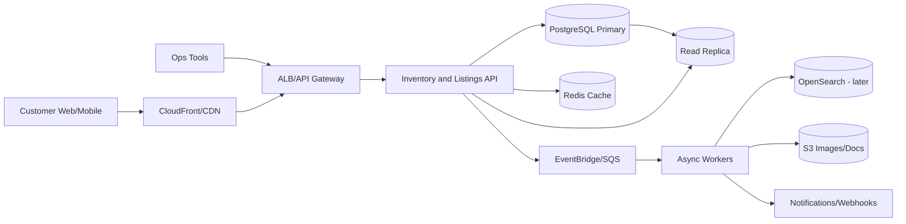

# 01 - System Design Plan

## Navigation

- Index: [README](README.md)
- Previous: [00 - Strategy and Assumptions](00-strategy-and-assumptions.md)
- Next: [02 - Data and PostgreSQL Plan](02-data-and-postgres-plan.md)

## Purpose

This stage guides `design.md`. The final design document must be concise enough for the assignment limit, but complete enough to show architecture judgment, scaling awareness, API boundaries, and explicit trade-offs.

## Target `design.md` Shape

Keep the final document tight:

1. Context and assumptions.
2. Architecture diagram and component notes.
3. Core data model and mutability.
4. API surface.
5. Scaling plan.
6. Three mini-ADRs.
7. Deferrals.

The assignment says max 6 pages including diagrams. The plan can be detailed; the final `design.md` should be selective.

## Proposed Architecture

Use a modular inventory/listings service at first, backed by PostgreSQL. Add supporting infrastructure for read scale, caching, events, and async side effects.

### Component Responsibilities

| Component | Responsibility | Scale/Resilience Notes |
| --- | --- | --- |
| Inventory and Listings API | Lifecycle operations, listing reads, reservation writes, basic catalog endpoints. | Keep modules separated internally: inventory, listings, reservations, stores, users. |
| PostgreSQL primary | Source of truth for units, listings, reservations, orders, idempotency, audits. | Strong constraints and transactions live here. |
| PostgreSQL read replica | Serve marketplace and ops read-heavy endpoints that can tolerate slight lag. | Do not use for reservation writes or strongly consistent availability checks. |
| Redis cache | Cache hot listing detail/search responses and short-lived computed views. | Cache is not source of truth for reservation correctness. |
| EventBridge/SQS | Publish lifecycle events and fan out async work. | Decouples search indexing, audit enrichment, emails, and analytics. |
| Async workers | Background jobs for search indexing, image processing, expiry sweeps, alerts. | Retryable with dead-letter queues. |
| OpenSearch | Later dedicated marketplace search and faceting. | Defer until PostgreSQL search/read path is proven insufficient. |
| S3 | Product images, inspection attachments, generated exports. | Store object metadata in PostgreSQL. |

## Service Boundary Decision

The final design should explicitly choose a modular monolith or single deployable service for the first 6 months.

Recommended choice:

- Build one Inventory and Listings API with clear internal modules.
- Keep reservation, listing, inventory lifecycle, and ops dashboard logic in one deployable unit initially.
- Use async events and database boundaries to prepare for later splits.

Why:

- The write volume is not high enough to justify early microservices.
- Reservation correctness benefits from one transaction boundary.
- The team can move faster and keep domain logic discoverable.
- Future split candidates are search/catalog reads, pricing, and analytics.

## Domain Model Plan

Minimum entities required by the prompt:

| Entity | Role | Important Relationships |
| --- | --- | --- |
| Store | Physical intake center. | Has many units, inspections, users. |
| User | Buyer, intake agent, inspector, store manager, admin. | Creates reservations, performs lifecycle events. |
| Unit | One physical item. | Belongs to intake store, has inspections, may have listing, may be ordered. |
| Inspection | Condition/refurbishment assessment. | Belongs to unit and inspector. |
| Listing | Marketplace sale record for a unit. | Belongs to unit and store, can have reservations/orders. |
| Reservation | Temporary hold for a buyer. | Belongs to listing and buyer, expires after 30 minutes. |
| Order | Completed purchase. | Belongs to listing, unit, buyer, reservation if used. |

Recommended supporting entities:

| Entity | Why It Helps |
| --- | --- |
| UnitEvent | Auditable lifecycle history for a unique physical item. |
| IdempotencyKey | Stores canonical reservation outcomes for safe retries. |
| Category | Avoids hardcoding category strings across listings and search. |

## Mutability Plan

The final design must call out mutable vs immutable fields. Use this framing:

| Field Type | Examples | Mutability |
| --- | --- | --- |
| Identity | `id`, `unit_code`, `listing_id`, `reservation_id` | Immutable. Used for traceability and external references. |
| Provenance | `intake_store_id`, `seller_reference`, `procured_at` | Mostly immutable after intake, except controlled corrections. |
| Lifecycle state | `unit.status`, `listing.status`, `reservation.status` | Mutable through allowed state transitions only. |
| Commercial data | `listing.price_cents`, `currency`, `listed_at` | Mutable before reservation/order, restricted after sale. |
| Reservation time | `reserved_at`, `expires_at` | Set at creation; status changes when expired/released/converted. |
| Audit fields | `created_at`, `updated_at`, `created_by` | Created fields immutable, updated fields mutable. |

## API Surface Plan

The final document should list 6-10 endpoints. Proposed set:

| Method | Path | Purpose | Auth/Concurrency Notes |
| --- | --- | --- | --- |
| `GET` | `/listings` | Marketplace listing search/list. | Public or customer auth optional; cacheable; read replica allowed. |
| `GET` | `/listings/{listing_id}` | Listing detail page. | Cacheable with short TTL; include availability derived from source of truth. |
| `POST` | `/listings/{listing_id}/reserve` | Hold a listing for checkout. | Buyer auth; primary DB transaction; idempotency key required. |
| `DELETE` | `/reservations/{reservation_id}` | Release buyer reservation. | Buyer auth; only owner can release; idempotent release preferred. |
| `POST` | `/orders` | Convert reservation to order. | Buyer auth; must lock reservation/listing; payment integration later. |
| `POST` | `/ops/units` | Intake a procured unit. | Staff auth; creates unit and audit event. |
| `PATCH` | `/ops/units/{unit_id}/status` | Move lifecycle state. | Staff auth; validate allowed transition. |
| `POST` | `/ops/units/{unit_id}/inspections` | Record inspection outcome. | Inspector auth; writes inspection and unit event. |
| `POST` | `/ops/listings` | Create/list a marketplace listing. | Staff auth; only priced/refurbished units can be listed. |
| `GET` | `/ops/dashboard/stuck-units` | Units stuck in workflow states. | Staff auth; indexed by store/status/timestamp. |

## Scaling Plan

### What Breaks First

| Area | Why It Breaks | Mitigation |
| --- | --- | --- |
| Marketplace search/list queries | High read volume, filters, sorting, pagination. | Composite/partial indexes, read replica, cache, eventually OpenSearch. |
| Listing detail hot spots | Popular products can create repeated reads. | CDN/API cache for detail responses with short TTL and invalidation on status changes. |
| Ops dashboards | Time-window scans by status/store can get expensive. | Status/timestamp indexes, precomputed dashboard views later. |
| Reservation races | Unique inventory means concurrent buyers compete for one row. | Primary DB row locks, partial unique indexes, idempotency table. |
| Large migrations | 50M-row table changes can lock or rewrite data. | Online migration pattern, batched backfill, concurrent index creation. |
| Async side effects | Search indexing/email/image jobs can block user flows if inline. | SQS/EventBridge, retry policies, dead-letter queues. |

### Scaling Sequence

1. Day one:
   - Correct schema, constraints, and indexes.
   - API pagination and bounded filters.
   - Reservation transaction correctness.
   - Structured logs and metrics.

2. Growth phase:
   - Read replica for list/detail and ops read endpoints.
   - Redis cache for hot listing detail/search pages.
   - Async workers for search indexing, lifecycle notifications, image processing.

3. Later:
   - OpenSearch for full-text/faceted search once PostgreSQL filters are insufficient.
   - Separate catalog/search service if marketplace read traffic dominates.
   - Partition historical reservation/order/event tables if retention grows.

## ADR Candidates

Use three mini-ADRs in the final design. Recommended ADRs:

1. Modular monolith now vs service split now.
2. PostgreSQL-backed listing search now vs OpenSearch immediately.
3. PostgreSQL transaction and row lock reservation vs Redis lock/reservation cache.

Each ADR should include:

- Context.
- Decision.
- Alternatives considered.
- Consequences.
- When to revisit.

## Deferral Plan

The final "what we would defer" paragraph should be honest. Recommended deferrals:

- OpenSearch until marketplace search shows PostgreSQL/caching limits.
- Dedicated microservices until ownership or scaling pressure is real.
- ML pricing, recommendations, fraud scoring, full payment/shipping workflows.
- Real-time server push for reservations; local countdown plus polling is enough for the slice.
- Advanced design system; keep frontend clean and accessible.

## Stage Acceptance Criteria

This stage is complete when `design.md` can answer:

- What is the system boundary?
- What data is strongly consistent?
- What can be eventually consistent?
- What grows with 7x scale?
- Which trade-offs were made deliberately?

